# 📈 Beyond Black-Scholes

> **An Event Study of Call Option Pricing in the Indian Financial Landscape**  
> **Using Taguchi L9 Orthogonal Array Methodologies · HDFC Bank · NSE**

---

## 📌 Project Overview

This project is an end-to-end statistical research study and interactive live dashboard built as part of the **MSc in Statistics and Data Science** programme at **SVKM's Narsee Monjee Institute of Management Studies (NMIMS), Mumbai**.

The study applies the **Taguchi L9 orthogonal array** to the **Black-Scholes Model (BSM)** for European call options — reducing 81 full-factorial experiments to just 9 balanced trials, while delivering complete sensitivity analysis across three time horizons using ANOVA, ANOM, S/N Ratio, and Regression. All findings are presented through a **live FastAPI dashboard** that fetches real-time NSE stock prices.

| Metric | Value |
|---|---|
| Stock Studied | HDFC Bank — HDFCBANK.NS |
| Factors Analysed | S₀ · K · r · σ (4 factors at 3 levels each) |
| Full Factorial Trials Required | 81 |
| Trials After Taguchi L9 | **9** |
| Reduction | **89% fewer runs** |
| Time Periods | 1 Week · 1 Month · 3 Months |
| Statistical Methods | Regression · ANOVA · ANOM · S/N Ratio |
| Dashboard | Live FastAPI — fetches real-time NSE prices |
| Data Source | [NSE India](https://www.nseindia.com/) |

---

## 👥 Authors

| Name | Roll No. | SAP ID |
|---|---|---|
| Eashal D'Britto | A014 | 86062500061 |
| Samiksha Kabra | A023 | 86062500017 |
| Omkar Navle | A037 | 86062500050 |
| Liz Rodrigues | A050 | 86062500051 |
| Mohammed Aamir Vahedna | A061 | 86062500028 |

**Mentor:** Dr. Pradnya Khandeparkar  
**RT Professor:** Mr. Vaibhav Vasundekar  
**Institution:** Nilkamal School of Mathematics, Applied Statistics and Analytics  
**Programme:** MSc Statistics and Data Science · Semester 1 · 2025–2026

---

## 📂 Repository Files

| File / Folder | Description |
|---|---|
| `dashboard/` | FastAPI live web dashboard — fetches real-time NSE prices |
| `analysis/python/regression_anova_diagnostics.py` | OLS regression + ANOVA + residual diagnostic plots |
| `analysis/python/anova_anom.py` | ANOVA percentage contribution + ANOM table |
| `analysis/r/sn_ratio_1week.Rmd` | S/N ratio analysis for T = 1 week |
| `analysis/r/sn_ratio_1month.Rmd` | S/N ratio analysis for T = 1 month |
| `analysis/r/sn_ratio_3month.Rmd` | S/N ratio analysis for T = 3 months |
| `report/GROUP_1_REPORT.pdf` | Full 49-page academic research report |
| `report/GROUP_1_PPT.pptx` | Presentation slides (41 slides) |
| `assets/images/` | All analysis and dashboard images used in this README |
| `.gitignore` | Excludes caches, virtual environments, Excel data files |
| `README.md` | This file |

---

## 🖥️ Live Dashboard

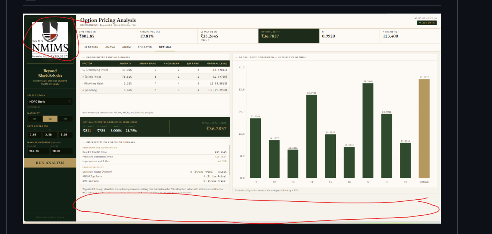

The dashboard fetches live NSE stock prices via `yfinance`, constructs the Taguchi L9 array in real time, computes Black-Scholes call prices for all 9 trials, and presents complete statistical analysis across five tabs.

### Dashboard Tabs

| Tab | What it shows |
|---|---|
| **L9 Design** | The 9-trial orthogonal array with live BS prices and factor levels table |
| **ANOVA** | Sum of squares, F-statistic, percentage contribution per factor |
| **ANOM** | Mean BS at each factor level · Delta · Rankings |
| **S/N Ratio** | Larger-the-better S/N values and factor robustness rankings |
| **Optimal** | Consolidated ranking · optimal combination · predicted BS price vs L9 max |

**Key Insight:** The dashboard updates live every time you click Run Analysis — pulling the current market price, computing annual volatility, and rebuilding all 9 L9 trials automatically.

---

## 🎯 Aim and Objectives

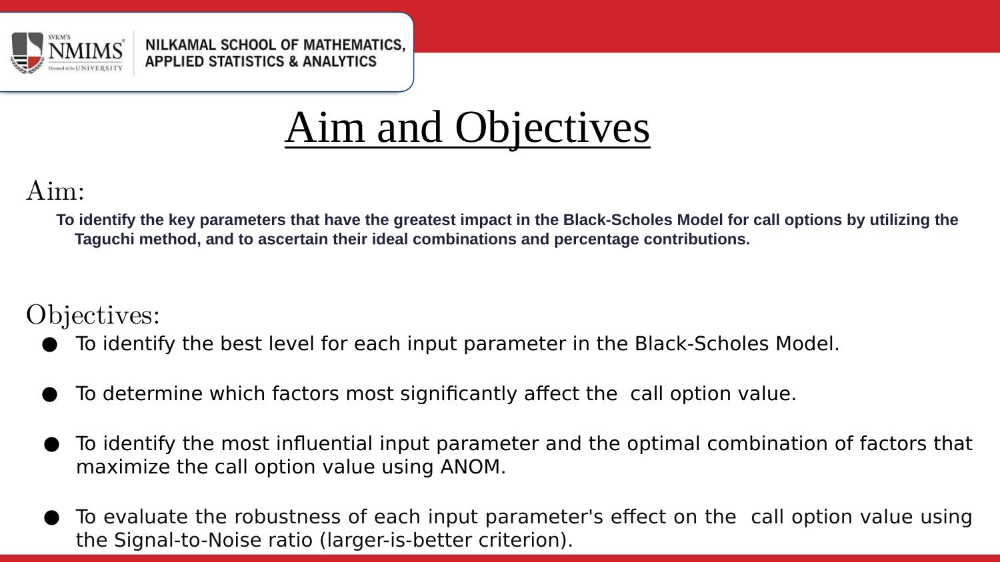

---

## 🧠 The Black-Scholes Model

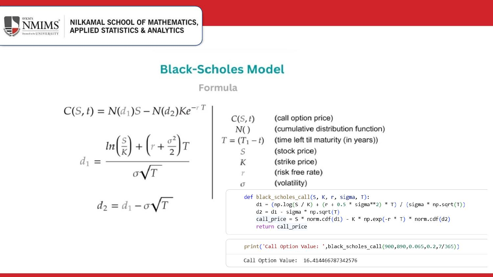

The BSM prices European call options using four input parameters — **S₀** (underlying price), **K** (strike price), **r** (risk-free rate), and **σ** (volatility). This study identifies which of these four parameters most significantly affects call option value and what combination of their levels maximises it.

---

## ⚙️ The Taguchi Method

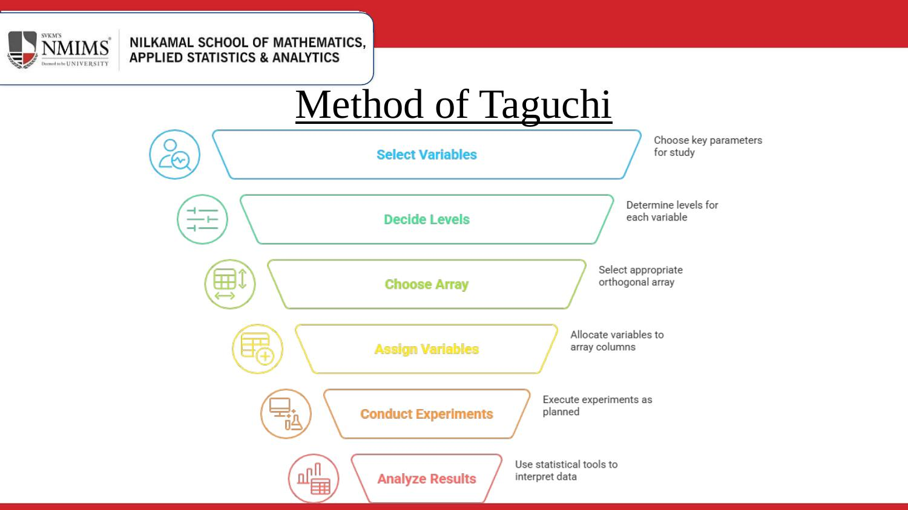

Taguchi's method uses **orthogonal arrays** to evaluate multiple variables simultaneously with the minimum number of experiments. Rather than testing all 81 possible combinations of 4 factors × 3 levels, the **L9 array covers just 9 balanced trials** — every factor level appears exactly three times, and every pair of levels appears together exactly once, ensuring unbiased estimation.

---

## 📐 Factor Levels

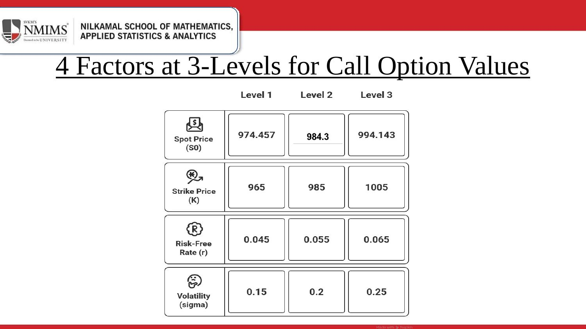

---

## 🔢 L9 Orthogonal Array Structure

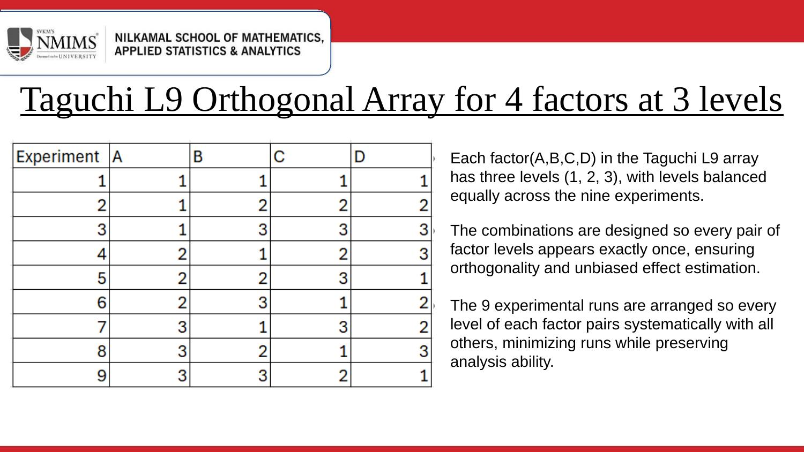

---

## 📋 L9 Design Applied — 1 Week Data with BS Prices

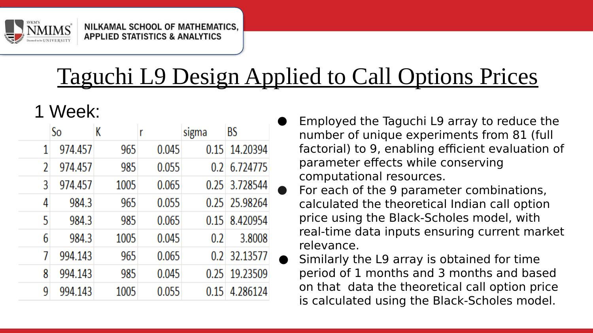

For each of the 9 parameter combinations, the Black-Scholes formula is applied to compute the call option value. T7 (S₀ at Level 3, K at Level 1) consistently produces the highest BS price — the highest stock price paired with the lowest strike price puts the option deepest in-the-money.

---

## 📉 Regression Analysis

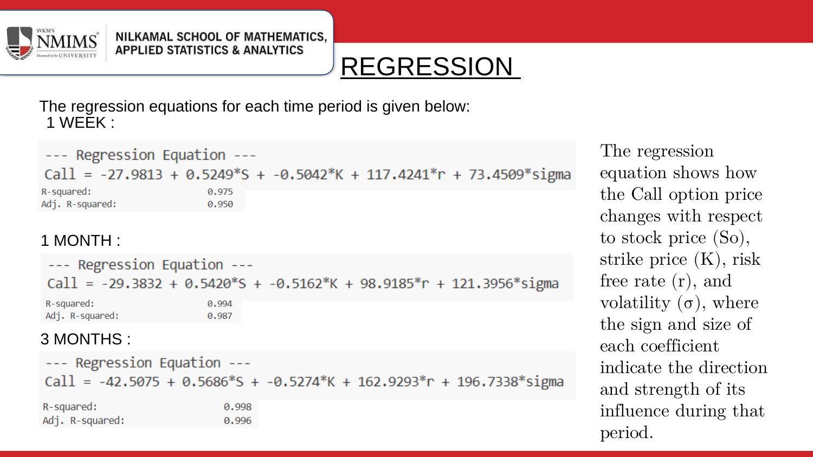

A multiple linear regression model was fitted for each time period:

```
Call = a + b₁·S₀ + b₂·K + b₃·r + b₄·σ
```

| Period | R² | Adj. R² | F-Statistic |
|---|---|---|---|
| 1 Week | 0.975 | 0.950 | 38.86 |
| 1 Month | 0.994 | 0.987 | 154.7 |
| 3 Months | 0.998 | 0.996 | 470.7 |

K carries a consistently **negative coefficient** across all periods — higher strike price directly reduces call value. S₀, r, and σ all carry positive coefficients.

---

### Regression Diagnostics — 1 Week

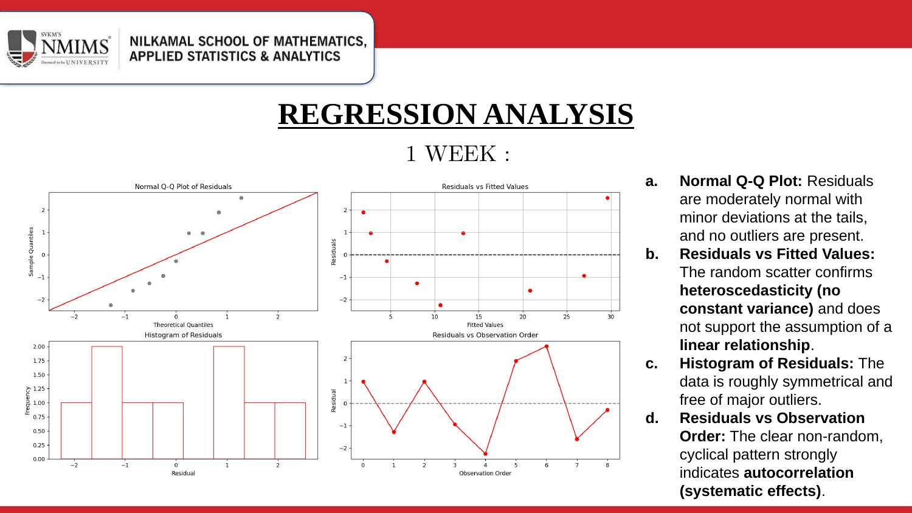

---

### Regression Diagnostics — 1 Month

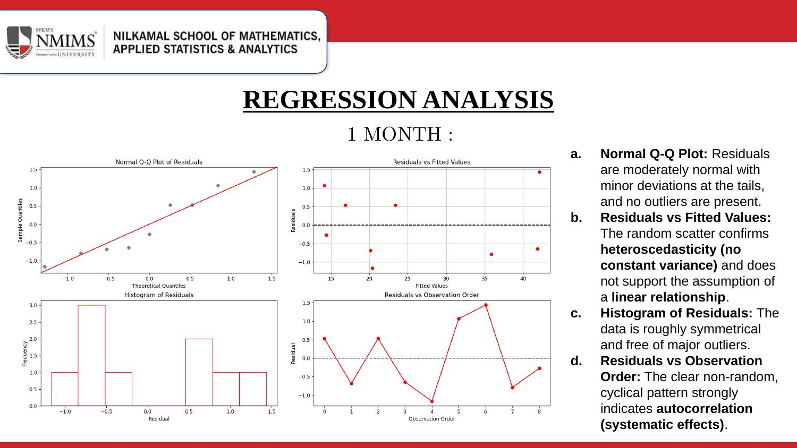

---

### Regression Diagnostics — 3 Months


Q-Q plots confirm approximate normality of residuals across all three periods. The Residuals vs Observation Order plots show a cyclical pattern — autocorrelation inherent to the structured Taguchi L9 design rather than a random sample.

---

## 📊 ANOM — Analysis of Means (All Three Periods)

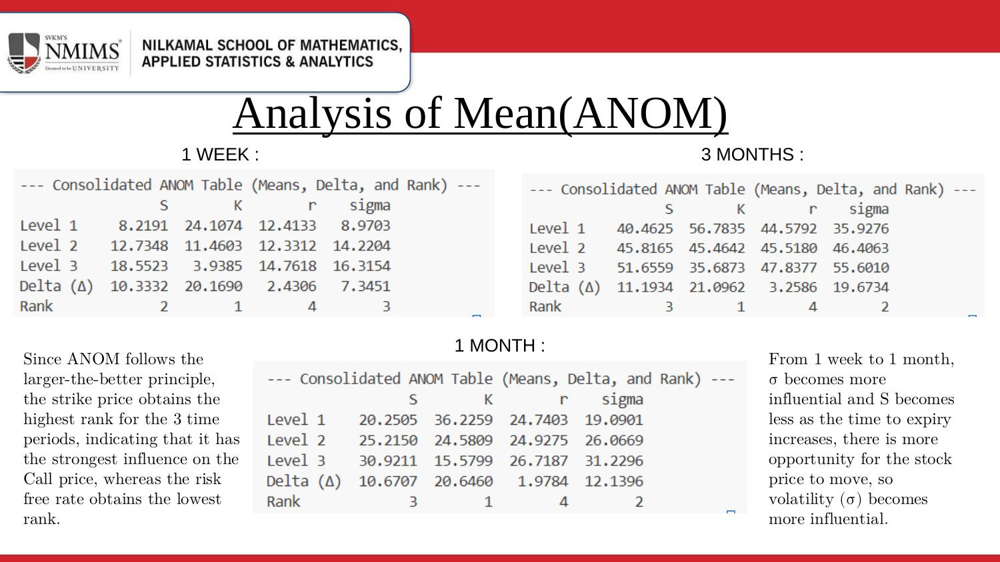

ANOM computes the mean BS call price at each level of each factor and ranks them by Delta (max level mean − min level mean).

**K (Strike Price) holds Rank 1 across all three time periods** — the choice of strike price produces the largest swing in option value. As maturity increases, σ rises from Rank 3 to Rank 2, gradually overtaking S₀ in importance.

---

## 📡 S/N Ratio — 1 Week

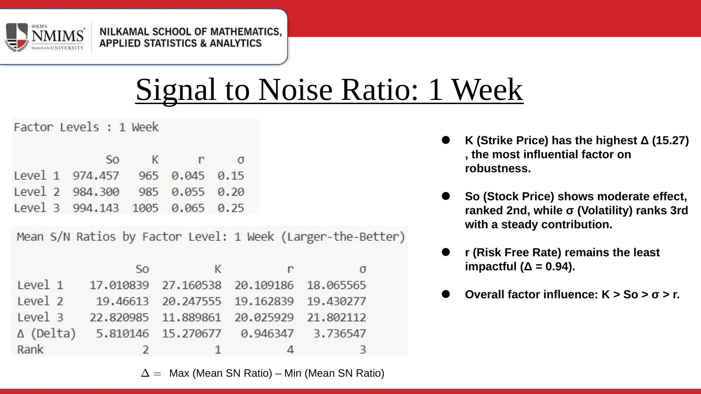

Using the **Larger-the-Better** criterion — `S/N = −10·log₁₀(1/n · Σ(1/yᵢ²))` — K has the highest Delta of **15.27**, making it by far the most influential factor on option robustness. r has a Delta of just 0.95, confirming near-zero impact.

### Main Effects Plots — 1 Week

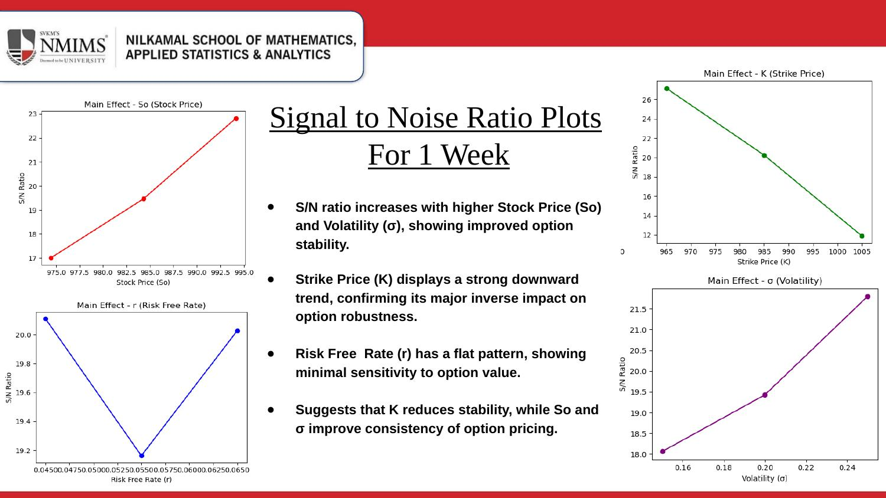

**Key Insight:** S₀ and σ show upward slopes — higher levels produce more consistent and higher option values. K shows a sharp downward slope — higher strike price consistently weakens robustness. r is essentially flat across all levels.

---

## 📡 S/N Ratio — 1 Month

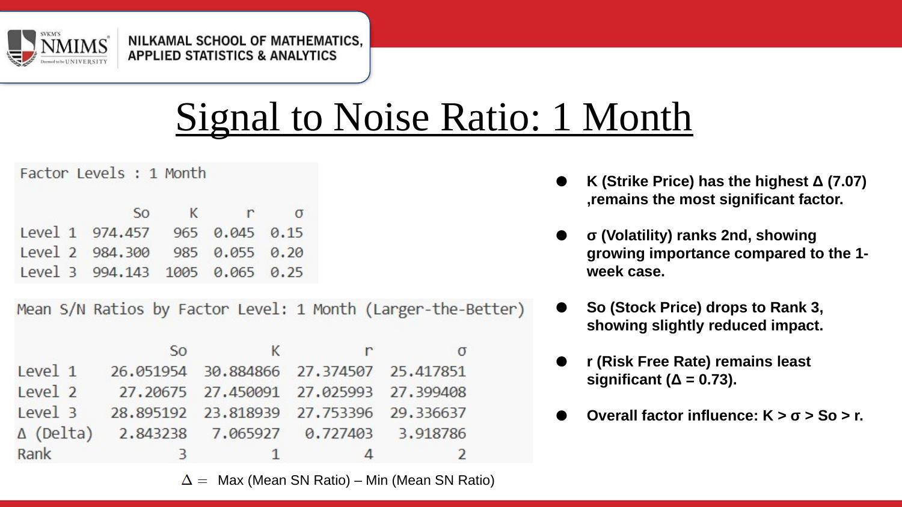

σ rises to Rank 2 (Delta = 3.92), showing growing importance as time to maturity extends. K retains Rank 1 with Delta = 7.07 — still dominant but with a reduced gap.

### Main Effects Plots — 1 Month

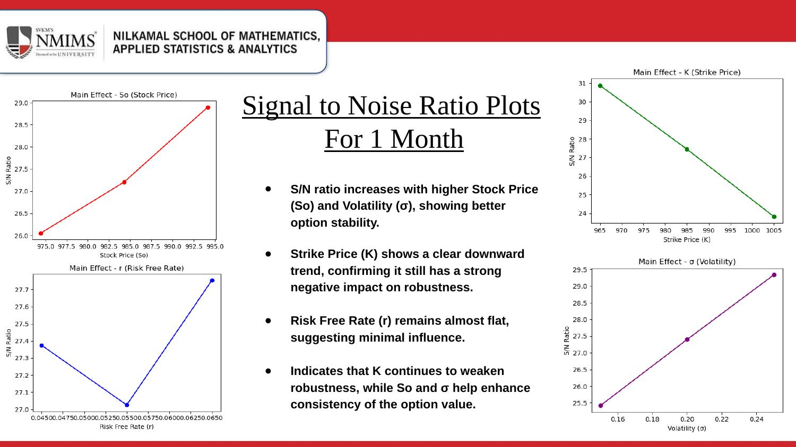

---

## 📡 S/N Ratio — 3 Months

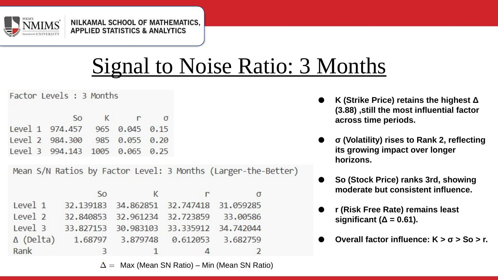

At 3 months, σ (Delta = 3.68) nearly catches K (Delta = 3.88) — confirming that volatility becomes increasingly dominant as time to expiry increases. This is consistent with the time-value of options: more time means more exposure to volatility movements.

### Main Effects Plots — 3 Months

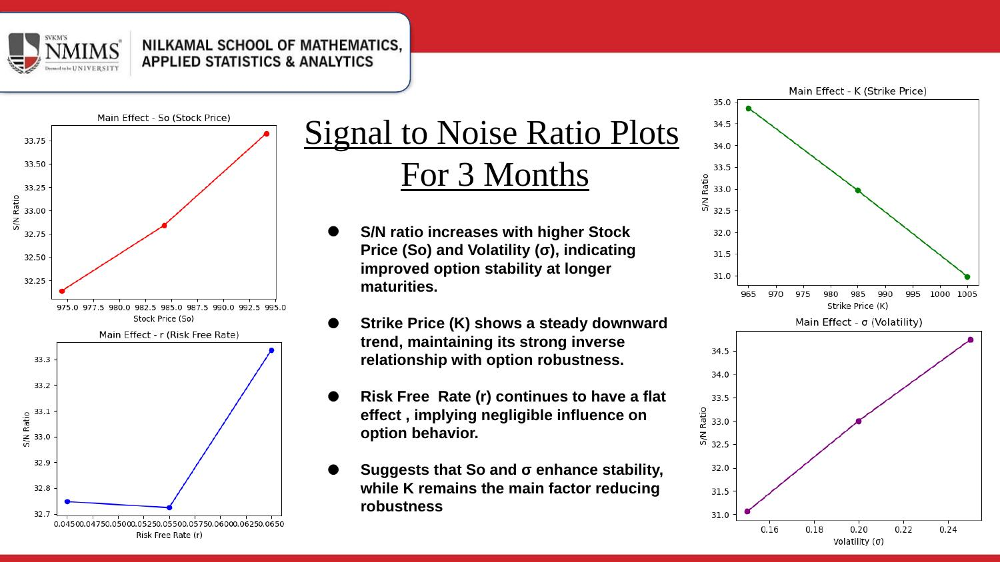

---

## 🏆 Optimal Combination

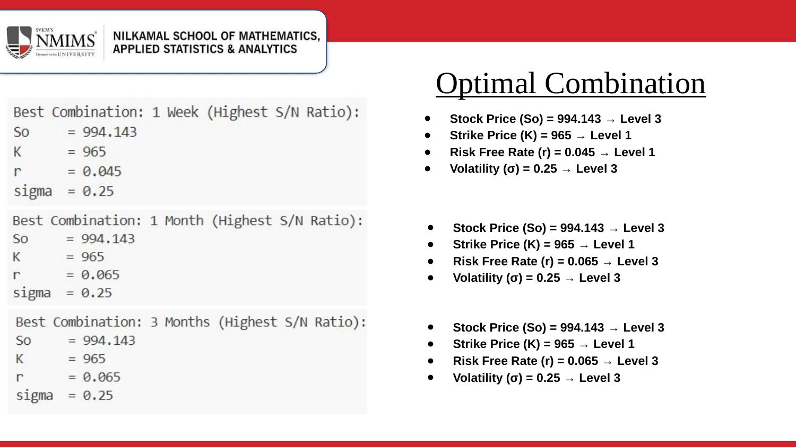

The optimal parameter combination is **consistent across all three maturities** for S₀ and K — always Level 3 and Level 1 respectively. High underlying price + low strike price = deepest in-the-money = maximum call value.

| Period | S₀ | K | r | σ | Optimal BS |
|---|---|---|---|---|---|
| 1 Week | 994.143 — Level 3 | 965 — Level 1 | 0.045 — Level 1 | 0.25 — Level 3 | ₹32.14 |
| 1 Month | 994.143 — Level 3 | 965 — Level 1 | 0.065 — Level 3 | 0.25 — Level 3 | **₹48.35** |
| 3 Months | 994.143 — Level 3 | 965 — Level 1 | 0.065 — Level 3 | 0.25 — Level 3 | ₹65.78 |

### Verification — 1 Month Optimal

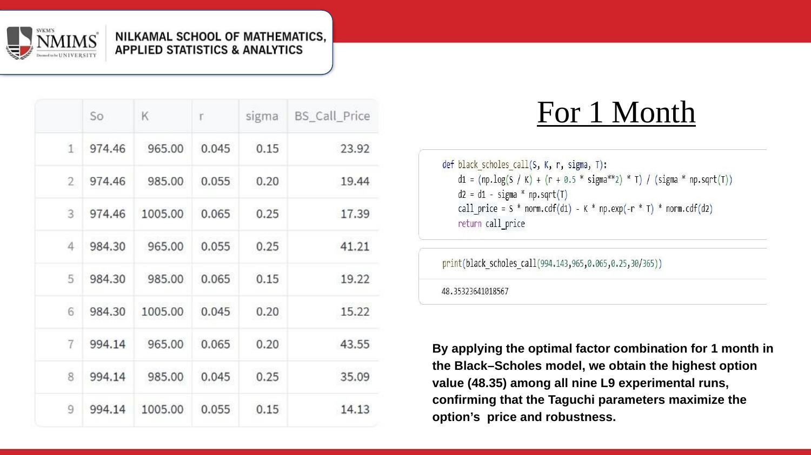

Applying the optimal combination to the Black-Scholes formula yields **₹48.35** — the highest value among all nine L9 trials, confirming the Taguchi analysis.

---

## ✅ Conclusion

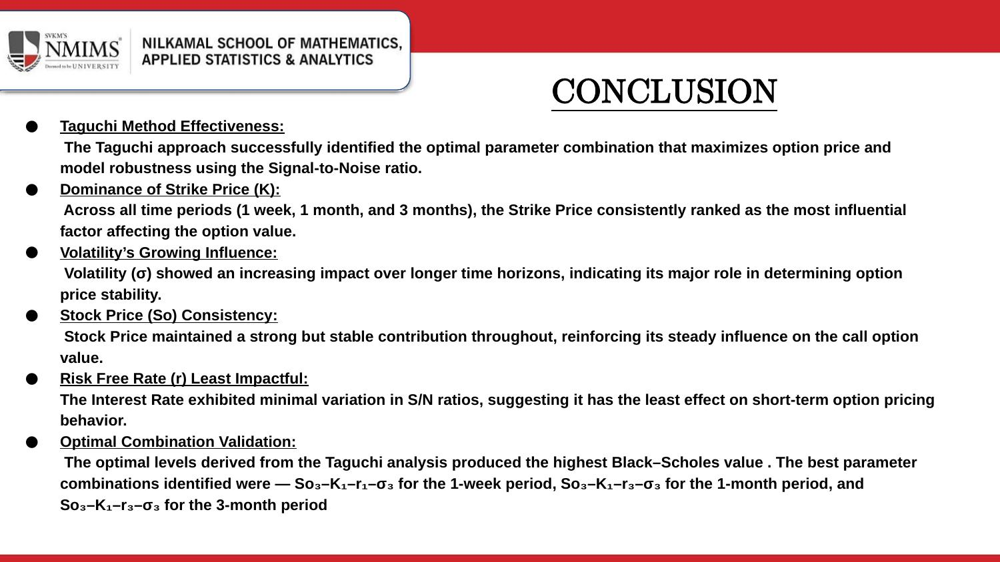

---

## 📈 Key Findings

| Finding | Value | Significance |
|---|---|---|
| Dominant factor (ANOVA) | K — Strike Price | 69.2% (1W) → 61.3% (1M) → 45.9% (3M) |
| σ contribution growth | 9.2% → 21.2% → 39.9% | Volatility doubles in importance every period |
| r contribution | < 1.1% across all periods | Risk-free rate has negligible effect |
| Model fit | R² = 0.975 / 0.994 / 0.998 | Excellent across all three maturities |
| ANOM Rank 1 | K — all three periods | Consistent dominance of strike price |
| S/N Rank 1 | K — Δ = 15.27 / 7.07 / 3.88 | K reduces robustness most |
| BS value range | ₹3.73–32.14 / ₹14.13–43.55 / ₹30.85–65.78 | Option value rises with maturity |
| Optimal combination | S₀₃ · K₁ · σ₃ | Consistent across all time periods |
| Best predicted BS | ₹48.35 (1 Month optimal) | Verified against all 9 L9 trials |

---

## 💡 Business Implications

1. **Strike price selection is critical** — it accounts for 45–69% of option value variation depending on maturity. Traders should prioritise K over all other parameters.
2. **Volatility matters more over time** — for longer-dated options (3M+), σ nearly matches K in importance. Factor in IV carefully for longer positions.
3. **Interest rate has minimal impact** — r contributes under 1.1% in all cases. Small changes in the risk-free rate can be safely de-prioritised in option pricing decisions.
4. **Taguchi reduces research costs** — 89% fewer trials required without compromising analytical depth. This methodology is replicable for other stocks and derivatives.

---

## 🚀 How to Use This Project

### Prerequisites

- Python 3.9+
- Internet connection (for live NSE price fetching)

### Running the Dashboard

```bash
git clone https://github.com/your-username/beyond-black-scholes.git
cd beyond-black-scholes/dashboard
pip install -r requirements.txt
python run.py
```

Open your browser at **http://localhost:8000**

### Running the Python Analysis Scripts

```bash
cd analysis/python

# OLS Regression + ANOVA + residual diagnostic plots (all 3 periods)
python regression_anova_diagnostics.py

# ANOVA % contribution + ANOM delta and rank table
python anova_anom.py
```

> Update `file_path` in each script to point to your local Excel data file before running.

### Running the R S/N Ratio Scripts

```r
install.packages(c("DoE.base", "ggplot2"))
# Open any .Rmd in RStudio → Knit → Knit to Word
```

---

## 🛠️ Tools and Technologies

| Tool | Purpose |
|---|---|
| **FastAPI + Uvicorn** | Web framework and server for the live dashboard |
| **yfinance** | Real-time NSE stock price and annual volatility fetching |
| **NumPy + SciPy** | Numerical computation and normal CDF for BS formula |
| **statsmodels** | OLS regression, ANOVA (Type II), residual diagnostics |
| **Pandas** | Data manipulation and ANOM table construction |
| **Python (Matplotlib)** | Residual diagnostic plots |
| **R (DoE.base + ggplot2)** | Taguchi array construction and S/N main effects plots |
| **Minitab** | Additional ANOVA and main effects verification |
| **GitHub** | Version control and project publishing |

---

## 📄 Full Report

The complete academic report is available in the `report/` folder:

📋 [`GROUP_1_REPORT.pdf`](report/GROUP_1_REPORT.pdf)

The report covers: Introduction · Motivation · Objectives · Data Preparation · Methodology · Taguchi Design · Regression Analysis · ANOM · S/N Ratio · ANOVA · Optimal Combination · Conclusion · Discussion · Future Scope · Bibliography

📊 [`GROUP_1_PPT.pptx`](report/GROUP_1_PPT.pptx)

---

## 🔗 References

1. Black, F., & Scholes, M. (1973). The pricing of options and corporate liabilities. *Journal of Political Economy*, 81(3), 637–654.
2. Merton, R. C. (1974). On the pricing of corporate debt. *Journal of Finance*, 29(2), 449–470.
3. Hull, J. C. (2016). *Options, Futures, and Other Derivatives* (9th ed.). Pearson Education.
4. Phadke, M. S. (1989). *Quality Engineering Using Robust Design*. Prentice Hall.
5. Roy, R. K. (2001). *Design of Experiments Using the Taguchi Approach*. Wiley.
6. Dar, A. A., & Anuradha, N. (2018). An application of Taguchi L9 method in Black-Scholes model for European call option. *International Journal of Entrepreneurship*, 22(1), 117–127.
7. NSE India — Live Market Data: https://www.nseindia.com/

---

## 📜 Licence

Submitted as academic coursework for the M.Sc. Statistics and Data Science programme at NMIMS Mumbai, 2025–2026.
Data sourced from NSE India under public market data terms.
Code, analysis, and report content are original work by Group 1.

---

*Built with Python · R · FastAPI · NMIMS Mumbai · November 2025*
